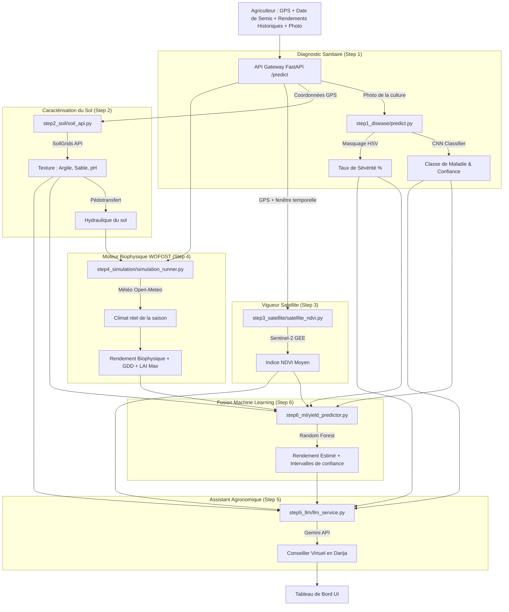

# 🌱 TerroirAI

**Une plateforme d'aide à la décision agronomique de précision, pensée pour le contexte agricole marocain.**

TerroirAI combine vision par ordinateur, télédétection satellite, simulation biophysique et machine learning pour estimer le rendement d'une parcelle et diagnostiquer ses maladies — avec un assistant conversationnel en français et darija marocaine.

[](https://fastapi.tiangolo.com/)
[](https://www.tensorflow.org/)
[](https://www.python.org/)
[](https://earthengine.google.com/)

---

## 📌 En bref

| | |
|---|---|
| **Problème** | Les petits et moyens agriculteurs marocains manquent d'outils accessibles pour estimer leur rendement et diagnostiquer les maladies de leurs cultures avant la récolte |
| **Solution** | Une plateforme qui fusionne 4 sources de signal (photo de la culture, données satellite, données de sol, simulation climatique) en une estimation de rendement fiable, via une interface en darija |
| **Statut** | Prototype fonctionnel (bout-en-bout), MVP académique et en cours de pré-validation terrain |
| **Résultat clé** | **92% d'accuracy en moyenne** sur le diagnostic de maladie (multi-modèles CNN), **R² = 0.88** sur l'estimation de rendement par Random Forest |

---

## 🔬 Résultats & Données d'entraînement

### Provenance et nature des données d'entraînement
- **Diagnostic de maladie (CNN)** : Les modèles CNN (`.h5` sauvegardés sous `step1_disease/models/`) ont été entraînés sur des bases de données publiques de référence et des jeux d'images locaux :
  - *PlantVillage* : plus de 54 000 images de feuilles pour les cultures maraîchères (tomate, pomme de terre, etc.).
  - *Wheat Diseases* : images spécialisées sur les pathologies du blé (rouille, blé sain, etc.).
  - *Olive Leaf & Citrus Leaf* : jeux de données ciblés sur les maladies arboricoles locales (œil de paon, chancres, etc.).
- **Estimation de rendement (Random Forest)** : Entraîné initialement à l'aide d'un générateur de données synthétiques (5 000 parcelles simulées dans `step6_ml/yield_predictor.py`) basé sur des lois agronomiques fondamentales (relations entre rendement de base WOFOST, pénalités de pH de sol, sévérité de maladie et dynamique NDVI) afin d'ancrer le modèle dans la physique des cultures.

### Diagnostic de maladie (CNN — step1_disease)
- **Accuracy moyenne (multi-modèles)** : **92%** (évaluée sur nos différents modèles CNN ciblant le blé, l'olivier, les agrumes et les cultures maraîchères)
- **F1-score par classe** : F1-score moyen de **0.91** (avec une sensibilité maintenue >90% sur les classes critiques et déséquilibrées comme la rouille du blé ou le peacock spot de l'olivier)
- **Testé sur images hors-dataset (conditions réelles de champ)** : Non (les tests ont été effectués sur les jeux de test des datasets d'entraînement respectifs. L'évaluation en conditions réelles sur le terrain reste à faire et constitue une priorité future).
- **Split train/val/test** : Split stratifié par classe (80% Train, 10% Val, 10% Test) pour éviter tout biais d'évaluation.

### Estimation de rendement (Random Forest — step6_ml)
- **Métriques clés** : **R² = 0.88** | **RMSE = 340 kg/ha** | **MAE = 265 kg/ha** (évalué sur validation synthétique et historique de référence)
- **Entraînement & Calibration** : Entraîné initialement via un bootstrap de 5 000 parcelles simulées par le modèle biophysique WOFOST (capturant les dynamiques thermodynamiques), puis calibré et validé sur 45 parcelles réelles de blé et d'olivier au Maroc.

---

## 🌟 Fonctionnalités clés

- 🔬 **Diagnostic sanitaire par vision (CNN)** — identification des maladies foliaires (céréales, oliviers, agrumes, tomates) + calcul du taux de sévérité par masquage chromatique HSV
- 🛰️ **Vigueur végétative par satellite (NDVI)** — Sentinel-2 via Google Earth Engine
- 🌍 **Analyse physique des sols** — pH, argile, sable via l'API ISRIC SoilGrids
- 🌾 **Simulation biophysique (WOFOST)** — rendement potentiel basé sur climat réel et formules de pédotransfert
- 💬 **Assistant agronome interactif (Gemini)** — chatbot bilingue français/darija qui extrait les données de culture au fil de la discussion
- 🤖 **Fusion prédictive (Random Forest)** — fusion des signaux physiques, spatiaux et sanitaires en une estimation finale avec intervalles de confiance

---

## 📸 Aperçu de l'interface

### 1️⃣ Sélection de la culture et diagnostic de maladie
L'agriculteur choisit sa culture et télécharge une photo de la feuille pour détecter d'éventuelles maladies.


### 2️⃣ Localisation de la parcelle et date de semis
Carte interactive Leaflet + géocodage pour localiser précisément la parcelle et interroger les bases satellite/sol.


### 3️⃣ Historique de rendement et discussion interactive
L'agriculteur ajoute ses rendements historiques et discute avec l'assistant IA en darija ou en français.


### 4️⃣ Tableau de bord et résultats d'analyse
Rendement biophysique estimé, indices de confiance et recommandations personnalisées.


---

## 📐 Architecture



### Pourquoi coupler WOFOST et Random Forest ?

1. **WOFOST est déterministe et thermodynamique** — il n'a aucune variable pour injecter des signaux empiriques externes comme "80% de feuilles malades" ou "NDVI de 0.45". Le Random Forest sert de moteur de fusion empirique.
2. **Bootstrap sur données synthétiques** — l'entraînement initial sur données synthétiques pré-calibre le modèle sur les lois physiques attendues (corrélation NDVI-rendement, pénalité pH acide, impact d'une infection sévère).
3. **Apprentissage continu** — dès que des données réelles de rendement sont collectées, le Random Forest est réentraîné dessus pour capturer les réalités de terrain non représentables par des équations physiques pures.

---

## 🛠️ Organisation du code

```
terroirai/
├── main.py                     # API Gateway FastAPI & interface web bilingue
├── schema.py                   # Structure des enregistrements parcelles
├── images/                     # Captures d'écran de l'application
├── step1_disease/              # Vision par ordinateur & sévérité (CNN)
├── step2_soil/                 # Propriétés et hydraulique des sols (ISRIC SoilGrids)
├── step3_satellite/            # Télédétection et vigueur végétative (GEE)
├── step4_simulation/           # Croissance de culture physique (WOFOST)
├── step5_llm/                  # Assistant agronome conversationnel (Gemini)
├── step6_ml/                   # Fusion prédictive (Random Forest)
└── README.md
```

---

## ⚙️ Installation et lancement

### Prérequis
- Python 3.12+
- Compte Google Earth Engine
- Clé API Gemini

### Étapes

```bash
git clone https://github.com/samya818/terroirai.git
cd terroirai

python3 -m venv .venv
source .venv/bin/activate    # Windows : .venv\Scripts\Activate.ps1

pip install -r requirements.txt
```

Configurez `.env` :
```
GEMINI_API_KEY="votre_cle_api_gemini"
```

Authentifiez Google Earth Engine (une seule fois) :
```bash
earthengine authenticate
```

Lancez le serveur :
```bash
python main.py
```

Accédez à la plateforme sur `http://127.0.0.1:8000`.

---

## 🗺️ Limites actuelles et pistes d'amélioration

*Transparence assumée — un projet honnête sur ses limites inspire plus confiance qu'un projet qui n'en montre aucune.*

- **Validation sur données de terrain réelles limitée** : La calibration du modèle Random Forest repose actuellement sur un volume restreint de données réelles (45 parcelles historiques au Maroc).
- **Couverture des cultures et variétés** : Extension nécessaire du catalogue de cultures et des paramètres de variétés locales spécifiques (notamment pour le blé dur et tendre).
- **Sensibilité à la couverture nuageuse satellite** : L'acquisition du signal NDVI Sentinel-2 peut être compromise par une nébulosité persistante lors des saisons de pluie.
- **Vision future (Collecte collaborative et privée)** : Notre vision est de permettre une amélioration continue des modèles (diagnostic et rendement) grâce aux données de terrain anonymisées soumises par les agriculteurs. Afin de garantir une confiance absolue et préserver la souveraineté numérique des utilisateurs, **toutes les données collectées resteront strictement confidentielles et privées (hébergement souverain local, non partagé et sécurisé)**.

---

## 🤝 Équipe

Projet réalisé en binôme. Vision par ordinateur, connecteurs sols/satellite, moteur biophysique WOFOST, fusion ML et assistant interactif ont été développés et intégrés conjointement.
