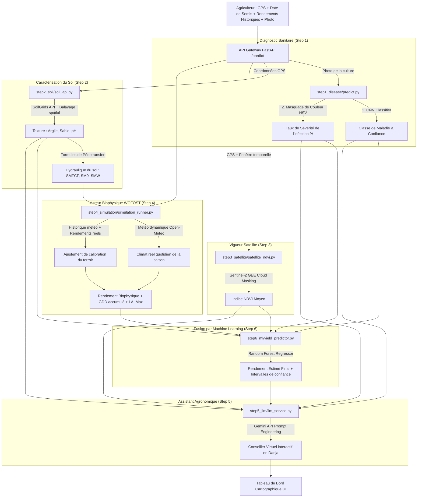

# 🌱 TerroirAI

[](https://fastapi.tiangolo.com/)
[](https://www.tensorflow.org/)
[](https://www.python.org/)
[](https://earthengine.google.com/)

**TerroirAI** est une plateforme d'aide à la décision agronomique de précision ouverte à tous, mais spécifiquement adaptée au contexte agricole marocain (avec des cultures répandues au Maroc, des particularités régionales comme la plaine du Tadla-Azilal, et une interface multilingue intégrant l'Arabe et la Darija). Elle combine la vision par ordinateur, la télédétection satellite, les moteurs physiques de croissance végétale et l'intelligence artificielle pour optimiser le rendement et la santé des cultures.

---

## 🌟 Fonctionnalités Clés

*   🔬 **Diagnostic Sanitaire par Vision (CNN)** : Identification instantanée des maladies foliaires (céréales, oliviers, agrumes, tomates) et calcul automatique du taux de sévérité par masquage chromatique HSV.
*   🛰️ **Vigueur Végétative par Satellite (NDVI)** : Intégration de Sentinel-2 via Google Earth Engine pour suivre l'état de la biomasse en temps réel.
*   🌍 **Analyse Physique des Sols** : Récupération automatique des caractéristiques physico-chimiques (pH, argile, sable) via l'API ISRIC SoilGrids.
*   🌾 **Simulation Biophysique (WOFOST)** : Simulation dynamique du rendement potentiel basée sur le climat réel et des formules de pédotransfert.
*   💬 **Assistant Agronome Interactif (Gemini)** : Chatbot intelligent bilingue (Français et Darija marocaine/Arabizi) qui extrait les données de culture au fil de la discussion pour pré-remplir le formulaire.
*   🤖 **Fusion Prédictive par Machine Learning** : Algorithme Random Forest entraîné pour fusionner les indicateurs physiques, spatiaux et sanitaires en une estimation finale fiable de rendement avec intervalles de confiance.

---

## 📸 Aperçu de l'Interface Utilisateur

Découvrez l'expérience pas à pas offerte par l'application TerroirAI :

### 1️⃣ Sélection de la Culture et Diagnostic de Maladie
L'agriculteur choisit son type de culture cible et télécharge une photo de la feuille pour détecter d'éventuelles maladies.
<p align="center">
  
  
</p>

### 2️⃣ Localisation de la Parcelle et Date de Semis
Grâce à une carte interactive Leaflet et au géocodage de noms de lieux au Maroc, la parcelle est précisément géo-localisée pour interroger les bases de données satellite et de sols.
<p align="center">
  
</p>

### 3️⃣ Historique de Rendement et Discussion Interactive
L'agriculteur peut ajouter ses rendements historiques pour calibrer la simulation et discuter de manière fluide avec l'assistant IA en darija marocaine ou en français.
<p align="center">
  
  
</p>

### 4️⃣ Tableau de Bord Complet et Résultats d'Analyse
Une fois l'analyse automatique exécutée, le tableau de bord affiche le rendement biophysique estimé, les indices de confiance et des recommandations personnalisées.
<p align="center">
  
</p>

---

## 📐 Architecture et Flux de Données

Le flux ci-dessous montre comment l'application combine la télédétection, la vision par ordinateur, les bases de données géophysiques mondiales, la thermodynamique de croissance végétale et le Machine Learning :



---

## 🛠️ Organisation du Code

```text
terroirai/
├── main.py                     # API Gateway FastAPI & Interface web bilingue HTML/JS
├── schema.py                   # Structure et sérialisation des enregistrements parcelles (ParcelRecord)
├── images/                     # Captures d'écran et ressources graphiques de l'application
├── step1_disease/              # Module 1 : Vision par ordinateur & Sévérité (CNN)
│   ├── predict.py              # CNN Multi-Modèles paresseux + Algorithme HSV d'estimation de sévérité
│   └── models/                 # Modèles de Deep Learning pré-entraînés
├── step2_soil/                 # Module 2 : Propriétés et hydraulique des sols (ISRIC SoilGrids)
│   ├── soil_api.py             # Client ISRIC SoilGrids v2.0 + Cache local + Fallback
│   └── soil_cache.json         # Cache persistant des requêtes de sol
├── step3_satellite/            # Module 3 : Télédétection et vigueur végétative (Google Earth Engine)
│   └── satellite_ndvi.py       # Intégration GEE (Sentinel-2 SR)
├── step4_simulation/           # Module 4 : Croissance de culture physique (WOFOST)
│   ├── openmeteo_weather.py    # Provider météo Open-Meteo pour PCSE/WOFOST
│   ├── wofost_simulation.py    # Script de test unitaire pour WOFOST
│   └── simulation_runner.py    # Orchestration WOFOST, climat de la saison et Calibration
├── step5_llm/                  # Module 5 : Assistant Agronome conversationnel
│   └── llm_service.py          # Intégration Gemini & Extraction d'entités structurées (Intake)
├── step6_ml/                   # Module 6 : Apprentissage supervisé et Fusion (Random Forest)
│   ├── yield_predictor.py      # Entraînement RandomForestRegressor + Inference
│   └── yield_rf_model.pkl      # Modèle Random Forest sérialisé
└── README.md                   # Documentation du projet (Ce fichier)
```

---

## 🧪 Choix de Conception et Rigueur Scientifique

### Pourquoi coupler WOFOST (Biophysique) et Random Forest (Machine Learning) ?

1.  **Limitation des Modèles Physiques (WOFOST)** : WOFOST est déterministe et thermodynamique. Il ne dispose d'aucune variable permettant d'injecter des signaux empiriques externes comme *"80% de feuilles malades détectées par photo"* ou *"NDVI satellite de 0.45"*. Le Random Forest sert de **moteur de fusion empirique** capable de lier ces variables non physiques avec le potentiel physique simulé.
2.  **La Stratégie de Bootstrap (Démarrage)** : L'entraînement initial sur 5 000 exemples synthétiques sert à **pré-calibrer** le modèle de ML. Il apprend les lois physiques sous-jacentes (ex: la corrélation positive entre NDVI et rendement, la pénalité d'un pH acide, l'impact négatif d'une infection sévère).
3.  **L'Apprentissage Continu (Monde Réel)** : Dès que l'application collecte des **données réelles de rendement à la récolte** auprès des agriculteurs, le Random Forest est réentraîné sur ces vraies données. Le modèle ML s'émancipe des simplifications théoriques pour modéliser les **réalités complexes de terrain** (pratiques agricoles réelles, efficacité des engrais, micro-climats) non représentables par des équations physiques pures.

---

## ⚙️ Guide de Lancement et d'Installation

### Prérequis
*   Python 3.12 ou supérieur
*   Un compte Google Earth Engine (pour l'API GEE)
*   Une clé d'API Gemini (pour l'assistant virtuel)

### Installation
1.  Clonez le dépôt :
    ```bash
    git clone https://github.com/samya818/terroirai.git
    cd terroirai
    ```
2.  Créez un environnement virtuel propre et activez-le :
    ```bash
    # Sous Windows (PowerShell) :
    python -m venv .venv
    .venv\Scripts\Activate.ps1

    # Sous Linux/macOS :
    python3 -m venv .venv
    source .venv/bin/activate
    ```
3.  Installez les dépendances :
    ```bash
    pip install -r requirements.txt
    ```
4.  Configurez vos variables d'environnement (dans un fichier `.env` non partagé sur Git) :
    ```env
    GEMINI_API_KEY="votre_cle_api_gemini"
    ```
5.  Authentifiez Google Earth Engine (nécessaire une seule fois) :
    ```bash
    earthengine authenticate
    ```

### Lancement
Démarrez le serveur FastAPI :
```bash
python main.py
```
Ouvrez votre navigateur sur `http://127.0.0.1:8000` pour accéder à la plateforme.

---

## 🤝 Contribution et Équipe
Ce projet a été réalisé en binôme. Toutes les contributions (diagnostic par vision, connecteurs sols et satellite, moteur biophysique WOFOST, fusion ML et intégration de l'assistant interactif) ont été développées et intégrées pour fournir une solution agronomique complète.
